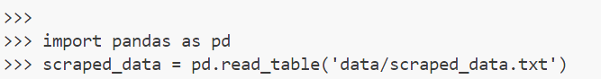
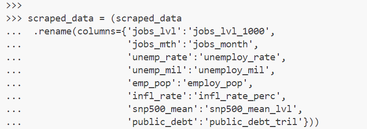
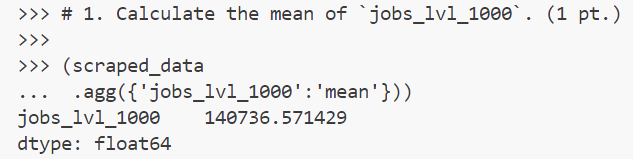
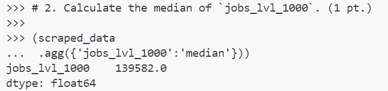
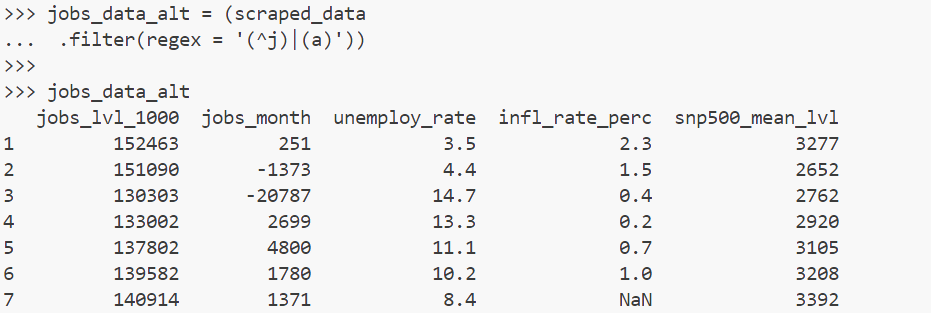
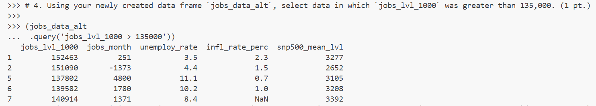
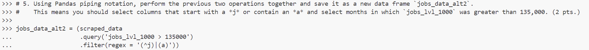
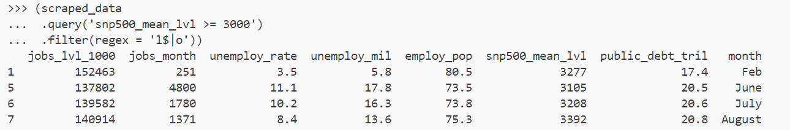
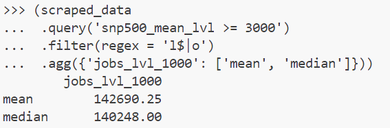

# Advanced Data Manipulation THA - Submission
This is the submission for `Vanessa Whattam`.

### Filtering with Pandas
1. Read in the file and import pandas

2. Rename the columns

3. Calculate the mean of `jobs_lvl_1000`. (1 pt.)

4. Calculate the median of `jobs_lvl_1000`. (1 pt.)

5. Select all columns that start with a *j* (i.e., `(^j)`) **or** contain an *a* (i.e., `(a)`). Save it as a new data frame named `jobs_data_alt`. Output the columns to the terminal. (1 pt.)

6. Using your newly created data frame `jobs_data_alt`, select data in which `jobs_lvl_1000` was greater than 135,000. (1 pt.)

7. Using Pandas piping notation, perform the previous two operations together and save it as a new data frame `jobs_data_alt2`. This means you should select columns that start with a *j* or contain an *a* and select months in which `jobs_lvl_1000` was greater than 135,000. (2 pts.)

### Querying with Pandas
1. Using Pandas piping notation, select all columns that end with the letter *l* (i.e., `l$`) or contain the letter *o* (i.e., `o`). Additionally, select rows in which `snp500_mean_lvl` is greater than or equal to 3000. (2 pts.)

2. Use the query you just performed. You will calculate the mean and median of `jobs_lvl_1000`. How does it compare to the answers above in which you calculated the mean and median? Please provide your answer in `submission.md`. (1 pt.)

The mean and median of `jobs_lvl_1000` after querying the data to only include `snp500_mean_lvl` that is greater than 3,000 are than the mean and median of the original dataset by approximately 2,000 and 700, respectively. This is expected, as when someone doesn't have a job they often aren't buying goods or spending money, which means the stock market isn't going up. So when we filter to include only higher S&P values, the number of jobs will likely be higher.

